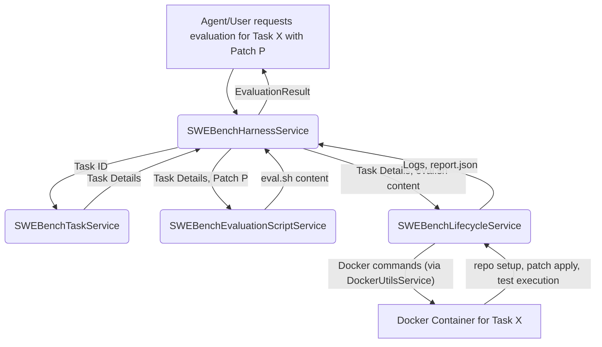

Okay, this is a great initiative! Building a robust, Effect-ified SWEBench harness will be a valuable asset, especially as a prerequisite for DGM-like systems. Here's a detailed plan for creating this harness within your "OpenAgents Commander" codebase using Docker.

## Plan: Effect-ified SWEBench Harness with Docker

**Objective:** To develop a fully Effect-TS-driven harness capable of running SWE-bench tasks within isolated Docker containers. This harness will programmatically set up task environments, apply generated patches, execute tests, and report results, providing a reliable way to evaluate coding agents.

**Core Principles:**

1.  **Effect-TS Native:** All operations, from task management to Docker interaction and result processing, will be modeled as Effect-TS programs, leveraging its strengths in error handling, concurrency, and resource management.
2.  **Docker for Isolation & Reproducibility:** Each SWE-bench task will be executed in a fresh, isolated Docker container based on official or compatible SWE-bench images, ensuring consistent environments.
3.  **Modularity & Testability:** Services will be designed as distinct, injectable `Layer`s for better organization and easier testing.
4.  **Configuration-Driven:** Key parameters like dataset paths, Docker image names, and timeouts will be managed via the existing `ConfigurationService`.
5.  **Agent Agnostic:** The harness will focus on evaluating a provided patch against a task, independent of how the patch was generated.

---

### I. Architecture Overview

The harness will consist of several Effect-TS services:

1.  **`SWEBenchTaskService`**: Responsible for loading and providing SWE-bench task definitions (instance ID, repository, base commit, problem statement, test files, etc.).
2.  **`DockerUtilsService`**: A low-level service abstracting Docker client interactions (e.g., using `dockerode` or `child_process` to call Docker CLI) into Effect-TS operations.
3.  **`SWEBenchLifecycleService`**: Manages the lifecycle of a SWE-bench task within a Docker container. This includes:
    *   Setting up the repository for a given task instance.
    *   Applying a patch file.
    *   Executing evaluation scripts.
    *   Collecting logs and artifacts.
4.  **`SWEBenchEvaluationScriptService`**: Generates the content of the evaluation script (`eval.sh`) that runs inside the Docker container.
5.  **`SWEBenchHarnessService`**: The main orchestrator. It takes a task ID and a patch, coordinates the other services to run the evaluation, and returns a structured result.

**Data Flow for a Single Evaluation:**



---

### II. Detailed Implementation Plan & Instructions for Coding Agent

#### **Phase 1: Foundational Services & Docker Setup**

**1.1. Docker Image Preparation:**
    *   **Instruction:** Ensure a suitable Docker image for SWE-bench is available. The official `swebench/swe-eval` image is a good starting point. This might involve pulling it or documenting how users should make it available.
    *   **Configuration:** Add `SWE_BENCH_DOCKER_IMAGE_NAME` (e.g., `swebench/swe-eval:latest`) to `ConfigurationService`.

**1.2. `DockerUtilsService` (Effect-TS Wrapper for Docker Client):**
    *   **Location:** `src/services/docker/DockerUtilsService.ts`
    *   **Instruction:**
        *   Choose a Node.js Docker client library (e.g., `dockerode`). Add it as a dependency.
        *   Create an Effect-TS service `DockerUtilsService` that wraps the chosen library's common Docker operations (e.g., `pullImage`, `createContainer`, `startContainer`, `execInContainer`, `getContainerLogs`, `copyToContainer`, `copyFromContainer`, `removeContainer`, `stopContainer`).
        *   All methods must return `Effect` types, handling errors by failing with a custom `DockerError` (see `src/services/docker/errors.ts`).
        *   **Example methods:**
            ```typescript
            // src/services/docker/DockerUtilsService.ts
            interface DockerUtilsService {
              createAndStartContainer(options: CreateContainerOptions): Effect.Effect<ContainerInfo, DockerError>;
              copyToContainer(containerId: string, srcPath: string, destPath: string): Effect.Effect<void, DockerError>;
              execInContainer(containerId: string, cmd: string[], workDir?: string): Effect.Effect<{ stdout: string, stderr: string, exitCode: number }, DockerExecError>;
              // ... other methods
            }
            export const DockerUtilsService = Context.GenericTag<DockerUtilsService>("DockerUtilsService");
            ```
        *   Implement `DockerUtilsServiceLive` using the chosen library. Ensure proper resource management (e.g., for streams from Docker logs).
        *   **Key Consideration:** `dockerode` uses Promises and Streams. Wrap these meticulously using `Effect.tryPromise`, `Effect.async`, `Stream.fromReadable`, etc. Ensure proper cleanup of Docker resources (containers, volumes if created).

**1.3. Basic Directory Structure:**
    *   **Instruction:** Create the following initial directory structure:
        ```
        src/
        └── services/
            ├── swe_bench_harness/
            │   ├── errors.ts       // Custom errors for the harness
            │   └── types.ts        // SWE-bench task & result types
            └── docker/
                ├── DockerUtilsService.ts
                ├── DockerUtilsServiceImpl.ts
                └── errors.ts       // DockerError, DockerExecError etc.
        ```

---

#### **Phase 2: SWE-Bench Task Management**

**2.1. `SWEBenchTask` Data Structure:**
    *   **Location:** `src/services/swe_bench_harness/types.ts`
    *   **Instruction:** Define a `SWEBenchTask` interface/schema. This should mirror the structure found in SWE-bench task JSON files (e.g., from the DGM paper's `swe_bench/meta/verified_*.json` files).
    *   **Fields:** `instance_id`, `repo`, `base_commit`, `problem_statement`, `hints_text`, `test_patch` (content of the test patch), `version`, `FAIL_TO_PASS`, `PASS_TO_PASS`.

**2.2. `SWEBenchTaskService`:**
    *   **Location:** `src/services/swe_bench_harness/SWEBenchTaskService.ts`
    *   **Instruction:**
        *   Implement `SWEBenchTaskService` to load task definitions.
        *   **Configuration:** Add `SWE_BENCH_DATASET_PATH` to `ConfigurationService` (path to a directory containing SWE-bench JSON files or a single manifest file).
        *   **Methods:**
            ```typescript
            // src/services/swe_bench_harness/SWEBenchTaskService.ts
            interface SWEBenchTaskService {
              getTask(instanceId: string): Effect.Effect<SWEBenchTask, TaskNotFoundError | ConfigError>;
              // Potentially: listAvailableTasks(subset?: string): Effect.Effect<string[], ConfigError>;
            }
            export const SWEBenchTaskService = Context.GenericTag<SWEBenchTaskService>("SWEBenchTaskService");
            ```
        *   `SWEBenchTaskServiceLive` should read JSON files from the configured path. Cache loaded tasks in memory for performance. Handle file system errors and JSON parsing errors, mapping them to custom harness errors.

---

#### **Phase 3: Evaluation Scripting & Lifecycle Management**

**3.1. `SWEBenchEvaluationScriptService`:**
    *   **Location:** `src/services/swe_bench_harness/SWEBenchEvaluationScriptService.ts`
    *   **Instruction:**
        *   Implement `SWEBenchEvaluationScriptService`.
        *   **Method:** `buildEvalScript(task: SWEBenchTask, patchFileName: string, evalDirInContainer: string): Effect.Effect<string, ScriptBuildError>`
            *   This method generates the content of an `eval.sh` script.
            *   The script should:
                1.  `cd` into the repository clone within the container (`${evalDirInContainer}/${task.repo_name}`).
                2.  Activate the correct conda environment (e.g., `eval "$(conda shell.bash hook)" && conda activate swe-bench`).
                3.  Set environment variables if needed (e.g., `PYTHONPATH`).
                4.  Apply the patch: `git apply /${evalDirInContainer}/${patchFileName}`. Check for successful application.
                5.  Run the evaluation commands. These are typically found in `task.test_patch` or derived from it (e.g., `python -m pytest -k "test_name"`). The DGM paper's `harness.py` or `eval_instance.py` shows logic for extracting test commands.
                6.  Capture test results. This can be done by redirecting pytest output or using its JSON reporting features. The script should output a `report.json` file in a known location (e.g., `/tmp/report.json` inside the container) or print structured JSON to stdout.
                7.  The script should handle patch application failures and test execution failures, exiting with appropriate codes.
        *   **Example `eval.sh` structure (simplified):**
            ```bash
            #!/bin/bash
            set -e # Exit on error
            echo "=== Setting up environment ==="
            # Conda setup commands...
            cd {{repo_path_in_container}}
            echo "=== Applying patch ==="
            git apply {{patch_path_in_container}}
            if [ $? -ne 0 ]; then
              echo "Patch application failed" > /tmp/report.json # Simple error report
              exit 1
            fi
            echo "=== Running tests ==="
            # {{test_command}} > /tmp/test_output.log 2>&1 # Capture test output
            # test_exit_code=$?
            # Create report.json based on test_exit_code and test_output.log
            # Example: echo '{"resolved": true, "tests_status": ...}' > /tmp/report.json
            exit 0 # or 1 if tests failed
            ```

**3.2. `SWEBenchLifecycleService`:**
    *   **Location:** `src/services/swe_bench_harness/SWEBenchLifecycleService.ts`
    *   **Instruction:**
        *   This service orchestrates operations within a single Docker container for one task instance.
        *   **Configuration:** `SWE_BENCH_CONTAINER_WORKDIR` (e.g., `/workspace`)
        *   **Dependencies:** `DockerUtilsService`, `ConfigurationService`.
        *   **Methods:**
            ```typescript
            // src/services/swe_bench_harness/SWEBenchLifecycleService.ts
            interface ContainerContext {
              containerId: string;
              evalDirInContainer: string; // e.g., /workspace/eval_task_id
              repoPathInContainer: string; // e.g., /workspace/eval_task_id/django
            }

            interface SWEBenchLifecycleService {
              setupTaskInContainer(task: SWEBenchTask): Effect.Effect<ContainerContext, LifecycleSetupError, DockerError | ConfigError>;
              runEvaluation(containerContext: ContainerContext, evalScriptContent: string, patchContent: string, patchFileName?: string): Effect.Effect<EvaluationReport, LifecycleEvalError, DockerError>;
              cleanup(containerContext: ContainerContext): Effect.Effect<void, DockerError>;
            }
            export const SWEBenchLifecycleService = Context.GenericTag<SWEBenchLifecycleService>("SWEBenchLifecycleService");
            ```
        *   **`setupTaskInContainer`:**
            1.  Create a unique temporary directory on the host.
            2.  Clone `task.repo` into this temp dir.
            3.  Checkout `task.base_commit`.
            4.  `DockerUtilsService.createAndStartContainer` using the configured SWE-bench image. Mount the host temp dir to `evalDirInContainer` inside the container.
            5.  Return `ContainerContext`.
        *   **`runEvaluation`:**
            1.  Write `patchContent` to `${patchFileName}` in the host temp dir (which is mounted).
            2.  Write `evalScriptContent` to `eval.sh` in the host temp dir.
            3.  `DockerUtilsService.execInContainer` to run `/bin/bash /${evalDirInContainer}/eval.sh`.
            4.  `DockerUtilsService.copyFromContainer` to retrieve `/tmp/report.json` from the container.
            5.  Parse `report.json` into `EvaluationReport` structure.
            6.  Handle script execution errors, timeout errors.
        *   **`cleanup`:**
            1.  `DockerUtilsService.stopContainer` and `removeContainer`.
            2.  Delete the host temporary directory.
        *   **Resource Management:** Use `Effect.acquireUseRelease` for managing the `ContainerContext` to ensure cleanup.

**3.3. `EvaluationReport` Data Structure:**
    *   **Location:** `src/services/swe_bench_harness/types.ts`
    *   **Instruction:** Define `EvaluationReport` based on the `report.json` structure used by SWE-bench/DGM.
    *   **Fields:** `instance_id`, `patch_applied_successfully` (boolean), `tests_passed` (boolean), `resolved` (boolean), `test_output` (string, optional), specific test statuses (e.g., `FAIL_TO_PASS_tests`, `PASS_TO_PASS_tests`).

---

#### **Phase 4: Harness Orchestration Service**

**4.1. `SWEBenchHarnessService`:**
    *   **Location:** `src/services/swe_bench_harness/SWEBenchHarnessService.ts`
    *   **Instruction:**
        *   This is the high-level service that users of the harness will interact with.
        *   **Dependencies:** `SWEBenchTaskService`, `SWEBenchLifecycleService`, `SWEBenchEvaluationScriptService`.
        *   **Methods:**
            ```typescript
            // src/services/swe_bench_harness/SWEBenchHarnessService.ts
            interface EvaluationResult {
              task_id: string;
              report: EvaluationReport;
              logs?: { stdout: string, stderr: string }; // Logs from eval.sh
              error?: string; // Overall error message if evaluation failed before report generation
            }

            interface SWEBenchHarnessService {
              evaluateTask(instanceId: string, patchContent: string): Effect.Effect<EvaluationResult, HarnessError>;
            }
            export const SWEBenchHarnessService = Context.GenericTag<SWEBenchHarnessService>("SWEBenchHarnessService");
            ```
        *   **`evaluateTask` Workflow:**
            1.  `Effect.gen` to manage the flow.
            2.  Get task details: `task = yield* _(SWEBenchTaskService.getTask(instanceId))`.
            3.  Define patch file name (e.g., `patch.diff`).
            4.  Build eval script: `evalScript = yield* _(SWEBenchEvaluationScriptService.buildEvalScript(task, patchFileName, containerWorkdir))`.
            5.  Use `Effect.acquireUseRelease` with `SWEBenchLifecycleService.setupTaskInContainer` for `acquire`.
            6.  In `use` (with `containerContext`): `report = yield* _(SWEBenchLifecycleService.runEvaluation(containerContext, evalScript, patchContent, patchFileName))`.
            7.  In `release`: `yield* _(SWEBenchLifecycleService.cleanup(containerContext))`.
            8.  Construct and return `EvaluationResult`.
            9.  Catch all errors and map them to `HarnessError`. Log detailed errors using `TelemetryService`.

---

#### **Phase 5: Configuration & Integration**

**5.1. Configuration Keys (Add to `src/services/configuration/ConfigurationServiceImpl.ts` `DefaultDevConfigLayer`):**
    *   **Instruction:**
        *   `SWE_BENCH_DOCKER_IMAGE_NAME`: e.g., `"swebench/swe-eval:latest"`
        *   `SWE_BENCH_DATASET_PATH`: e.g., `"./assets/swe_bench_data"` (developer needs to place data here)
        *   `SWE_BENCH_CONTAINER_WORKDIR`: e.g., `"/swe_bench_workdir"`
        *   `SWE_BENCH_HOST_TEMP_DIR`: e.g., `"/tmp/swe_bench_runs"` (ensure this path is writable)
        *   `SWE_BENCH_MAX_CONCURRENT_EVALS`: e.g., `"2"`

**5.2. Layer Composition (in `src/services/runtime.ts` or a dedicated harness runtime):**
    *   **Instruction:** Compose the layers for all new services.
        ```typescript
        const SweBenchHarnessFullLayer = SWEBenchHarnessServiceLive.pipe(
          Layer.provide(SWEBenchTaskServiceLive),
          Layer.provide(SWEBenchLifecycleServiceLive),
          Layer.provide(SWEBenchEvaluationScriptServiceLive),
          Layer.provide(DockerUtilsServiceLive), // Assuming this wraps dockerode or CLI calls
          Layer.provide(ConfigurationServiceLive), // Or DefaultDevConfigLayer
          Layer.provide(TelemetryServiceLive)
        );
        ```

**5.3. IPC Endpoint (Optional - for UI interaction):**
    *   **Instruction:** If Commander's UI needs to trigger evaluations:
        *   Define IPC channels (e.g., `swebench:evaluate-task`).
        *   Add an IPC listener in `main.ts` that uses the `SWEBenchHarnessService` to run an evaluation and returns the result.
        *   Expose an IPC invoker via `contextBridge` for the renderer.

---

### III. Instructions to the Coding Agent (General)

1.  **Embrace Effect-TS Idioms:**
    *   Use `Effect.gen` for imperative-style flows.
    *   Manage resources with `Effect.acquireUseRelease` or `Effect.scoped`.
    *   Handle all errors explicitly in the error channel of `Effect`. Define custom, tagged errors for each service/operation.
    *   Use `Layer` for dependency injection. Services should depend on interfaces (`Context.Tag`), not concrete implementations.
    *   Make extensive use of `Schema` for data validation and type safety, especially for task definitions and report structures.

2.  **Modularity:**
    *   Keep services focused on their specific responsibilities.
    *   Ensure services are easily testable by mocking their dependencies.

3.  **Error Handling & Logging:**
    *   Propagate errors up through the Effect error channel. Avoid `try/catch` unless converting non-Effect errors.
    *   Use the `TelemetryService` for logging important events, errors, and debug information within Effects (e.g., `Effect.tap(() => telemetry.trackEvent(...))`).
    *   Define clear error types (e.g., `DockerError`, `TaskNotFoundError`, `PatchApplyError`, `EvaluationError`, `HarnessError`).

4.  **Configuration:**
    *   All configurable values (paths, image names, timeouts) must be fetched from `ConfigurationService`.

5.  **Docker Interaction:**
    *   All direct Docker commands must go through `DockerUtilsService`.
    *   Pay close attention to file paths (host vs. container). Use path joining utilities (`path.join`) and be mindful of OS differences if host paths are involved before copying to container.
    *   Ensure containers are cleaned up properly, even on error. `Effect.ensuring` or `Effect.acquireUseRelease` are vital here.

6.  **Security:**
    *   The evaluation script runs arbitrary code (tests) and applies patches. While Docker provides isolation, be mindful of any volumes mounted from the host. The host temporary directory should be outside the main application code.
    *   Do not pass sensitive environment variables from the main Electron app into the Docker container unless strictly necessary and sanitized.

7.  **Asynchronous Operations:**
    *   All async operations (file I/O, Docker calls, process execution) MUST be wrapped in `Effect`.

8.  **Testing:**
    *   Write unit tests for each service. Mock dependencies using `Layer.succeed` with test implementations.
    *   For `DockerUtilsService`, you might have integration tests that actually hit a local Docker daemon, but unit tests should mock the Docker client library.

9.  **Documentation:**
    *   Add JSDoc comments to all services, methods, and important types.
    *   Consider adding a `docs/swe-bench-harness.md` file to document the architecture and usage.

---

This plan provides a comprehensive roadmap. The agent should tackle it phase by phase, ensuring each service is well-tested before moving to the next. Good luck!
